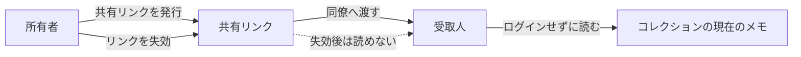
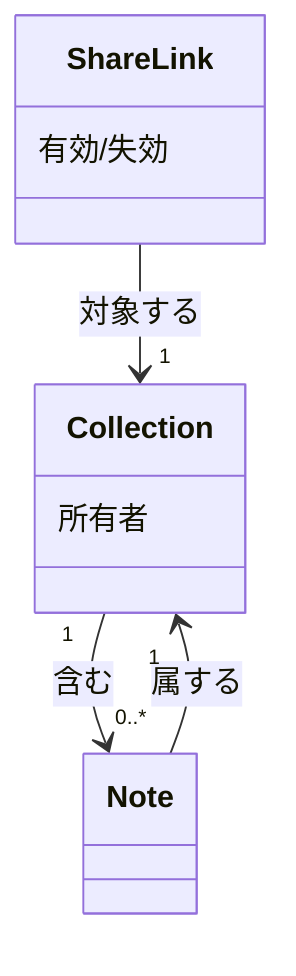

# コレクションの読み取り専用共有リンク

所有者がコレクションの読み取り専用リンクを発行し、受取人がログインせずにそのコレクションの現在の内容を読めるようにする。

## Problem

研究者はメモを同僚に見せるたびに、メモの内容を別文書へコピーしている。コピーは編集のたびに作り直しが必要で、原本を直してもコピーには反映されない。そのため同僚との検討が古いコピーの内容に基づいてしまう。

## 導出

`## Story` のコアアクション「コレクションを読み返して次に調べる問いを決める — 週次」を、同僚との検討にも広げるための機能。

## Overview

所有者がコレクションごとに共有リンクを発行し、そのリンクを同僚へ渡す。受取人は NoteShelf にログインせず、リンクを開いただけでそのコレクションの現在の内容を読める。所有者は、渡したリンクを失効させられる。共有は読み取り専用で、受取人の変更は NoteShelf のメモへ反映されない。

### Goals

- メモをコピーせずに、コレクションの現在の内容を同僚へ渡せるようにする
- 原本を直した内容が、渡した共有リンク経由でもそのまま見られるようにする
- 所有者が、渡し済みの共有リンクを自分で止められるようにする

### Non-Goals

- 共同編集: 読み取り専用であり、受取人の変更は NoteShelf のメモへ反映しない
- 閲覧者の本人確認: リンクを知る人は誰でも読めてよい
- 通知: 共有した旨を閲覧者へ知らせる仕組みは作らない
- 共有履歴の分析: 誰がリンクを読んだかの記録・集計は行わない

## Glossary

- 匿名閲覧: ログインなしで共有リンクからコレクションを読む利用形態。この機能に閉じる語であり、複数機能をまたぐ実体である共有リンクとは別の語として扱う。

## Domain Model

用語の定義は `AGENTS.md` の `## Glossary` を参照（メモ（Note）、コレクション（Collection）、共有リンク（ShareLink））。

- コレクションはメモを 0 件以上含む。メモが 0 件でも所有者なら共有リンクを発行できる。
- 各メモは必ず 1 つのコレクションに属する。[ADR-0001: メモの所属を1つにする](../../adr/0001-single-collection.md)
- 共有リンクは必ず 1 つのコレクションだけを対象にする。1 本のリンクで複数コレクションをまとめて公開しない。
- 共有リンクの発行・失効ができるのは、そのコレクションの所有者だけ。
- 共有リンクが有効な間、対象コレクションの現在のメモは、リンクを受け取った人なら誰でも読める（閲覧者の本人確認は行わない）。
- 失効は対象の共有リンクだけを止める。コレクションとメモは失効によって削除されない。
- 未確定: 1 つのコレクションで同時に有効にできる共有リンクの数。図ではこの多重度を省略している。

## Acceptance Criteria

- [ ] 研究者がコレクションの共有リンクを発行して同僚へ渡すと、同僚はログインせずにそのコレクションの現在のメモを読める
- [ ] 所有者がメモを追加・更新した後、受取人が同じ共有リンクを開くと、更新後の内容が見られる
- [ ] 所有者が共有リンクを失効すると、それを受け取った受取人はそのリンクからコレクションの内容を読めなくなる

## Success Metrics

- コアアクション: 共有リンクを発行して同僚へ渡す
- 期待頻度 (cycle): 週次
- 数える対象: 自分から NoteShelf を開いた人のうち、共有リンクを発行した人数（通知・メール経由の来訪は除く）
- 主指標: onboarding 後の翌週にも共有リンクを発行して戻った割合。目標値は未確定