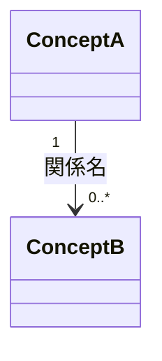

# <機能名>

## Problem

<何が問題か、なぜ今解決する必要があるか>

## 導出

<この機能が repo root AGENTS.md の ## Story のどこから出るか、一文>

## Overview

<機能の概要>

### Goals

- <この機能で達成したいこと (why)>

### Non-Goals

- <スコープ外。スコープから外した案もここ>

## Glossary

<本文の理解に要る語だけ。この機能内に閉じる語はここが正本。domain model 級（複数機能・session を跨ぐ実体の名詞）の語だけ AGENTS.md の ## Glossary にも置く。不要なら節ごと削除>

## Domain Model

<概念と関係を Mermaid の classDiagram（クラス図）で表現する。以下は記法例なので、概念名・関係名・多重度を整理したモデルに置き換える。クラスはドメインの概念を表し、理解に必要な属性だけを含める。DB schema・実装クラスのメソッドや型などの実装方法は書かない。未確定の多重度は省略し、未確定と文章で明記する。モデルを整理していなければ節ごと削除>

<境界・常に成り立つルール・未確定の点など、図だけでは伝わらない内容を文章で補う。用語の定義は、機能固有ならこの PRD の Glossary、domain model 級なら repo root AGENTS.md の ## Glossary を参照する。ADR があればこの節内に [ADR-NNNN: <判断名>](../../adr/NNNN-slug.md) を置く>

## Acceptance Criteria

<ユーザーストーリー粒度だけで、1項目1文にする。操作手順・画面要素・例外ケースごとには分解しない>

- [ ] <誰が何をして、どんな結果を得られるか>

## Non-Functional Requirements

<rate limit など重要な非機能要件がある場合のみ、1要件1行で簡潔に書く。判定に必要な条件・数値は含め、実装方法や網羅的なチェックリストは書かない。重要な要件がなければ節ごと削除>

- <守る制約と判定条件。rate limit なら対象・回数上限・時間窓・超過時の振る舞い>

## Success Metrics

- コアアクション: <ユーザーが実際にやること>
- 期待頻度 (cycle): <日次 / 週次 / 月次 / 年数回>
- 数える対象: <自分から開いた人のうちコアアクションを取った数>
- 主指標: <onboarding 後の翌日・翌週にコアアクションを取って戻ってきた割合>
