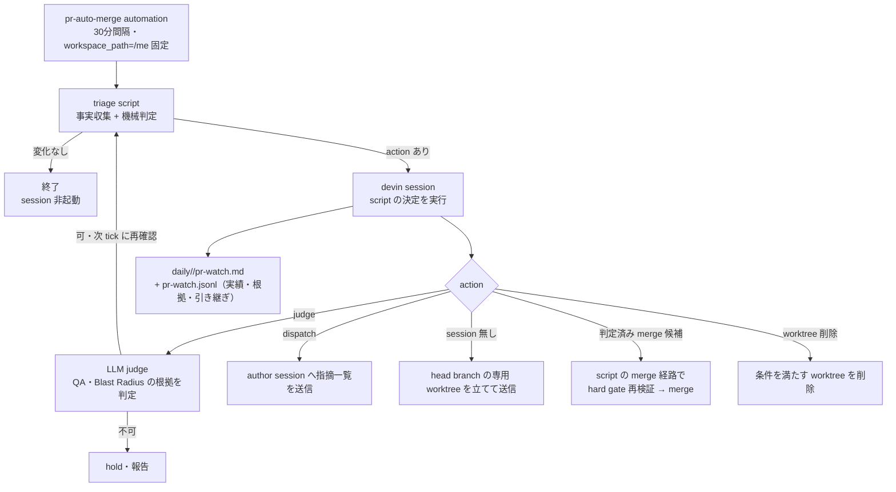

# pr-merge-lane — レビュー応答の routing と低リスク lane の自動 merge

## Problem

`pr-auto-merge` routine は1日1回（10:00）に `wwwyo/*` の open PR をレビューし、基準を満たすものだけ merge する。この運用に3つの問題がある。

**レビュー指摘が誰にも届かない。** Pullfrog 導入（2026-09-25）以降、PR には自動でレビューが降る。だが指摘を直せるのはその PR を作った agent session だけで、session は新しいレビューが届いたことを知らない。指摘は翌日の routine まで放置され、routine も「未解消のレビューコメントがある」を理由に hold するだけで、直す側へは何も届かない。レビュー→修正の往復が1日1回しか回らず、1件の指摘往復に数日かかる。

**merge 判定が狭すぎる。** 現行ルールで自動 merge できるのは dependabot の依存更新と、nits・学び PR の狭い条件だけ。agent session や人間の PR は「CI green + Pullfrog が approve 済み + 中身が明確に低リスク」でも必ず hold になり、merge はすべて本人の手作業になる。Pullfrog が `pullfrog-approval` status check という機械可読の OK を既に出しているのに、それを判定材料に使っていない。

**merge 済みの worktree が残り続ける。** PR が merge されても対応する Orca workspace は消えず、`liveTerminalCount>0` なら cleanup routine の30日ルールでも消せない。役目を終えた workspace がサイドバーに残り続ける。

いま解く理由: Pullfrog のレビュー自動化と Orca の worktree/terminal API（`orca worktree ps --json` で branch・linkedPR・agent 状態を取得できる、`terminal send` で session に届けられる）が揃った。加えて、低リスク自動 merge の設計パターン（リスクの自己申告をさせない・書き手とレビュアーを分ける・関門を prompt ではなくコードで持つ）は、Ona の low-risk policy やリスク採点型の merge gate 等で実例が出ており、ここに当てはめられる。

## 導出

repo の Story「agent session を起こして開発タスクを進める — 日次・複数回」から出る。複数 session が並行して PR を出す前提になった以上、レビュー応答と merge を人間が手で運ぶと、台数を増やすほど待ち行列だけが伸びる。この機能はその処理を機械へ渡し、本人は基準の設定と抜き取り確認だけを担う。

## Overview

既存の `pr-auto-merge` automation を流用し、30分間隔・`workspace_path` 固定に変更する（`repo_path` では run ごとに新 worktree が立つため）。trigger は cron `*/30 * * * *` とする — Orca の RRULE parser は `FREQ=HOURLY/DAILY/WEEKLY` と `INTERVAL` にしか対応せず `MINUTELY` は表現できないため。各 tick の役割分担は次のとおり。

1. **triage script** が全 open PR の事実を集め、action を決める。変化なしなら agent を起こさず終了する
2. action があるときだけ devin session が起き、script の決定を実行する（dispatch・merge・削除・報告記述）
3. **常に hold の path を除く全 merge 候補が LLM judge に回る**（この routine の判定役で、レビュアーではない）。judge は PR 本文の QA・Blast Radius を差分と検証結果に照合する。影響の深刻さ・検証状況・復旧可能性から高なら hold、中なら影響に対応する検証済みで可、低なら可とする。自己申告の根拠が確かかも確認し、判断できなければ hold。判定は head SHA・本文・base・check 結果に紐付け、判定材料が変わったら無効化する。judge が可としても、merge は script の merge 経路で hard gate を再検証してからでないと発行しない — LLM の判定は lane への推薦であり、merge の発行権は持たない
4. 競合・bot の依存更新の CI 失敗・judge が repair とした major 更新の追従も毎 tick で検出し、同じ dispatch 経路で author session に渡す。機械的な追従だけを修正し、push 後の merge 判定は次 tick の script が行う。日次の全件レビューと重複 PR の統合・close は行わない。

**判定の二層構造**: script が持つのは再現可能な事実の gate（unaddressed 判定・path 分類・`pullfrog-approval` が現在 head SHA で success か・未解消 thread 0・required check が fail/pending でないか・dispatch 上限）。LLM judge が持つのは全 merge 候補の diff・QA・Blast Radius の意味判定。この分離で「関門はコードが握り、意味の要る判定だけを LLM に渡す」を成立させる。

**path の3分類**:

- **常に hold（lane・LLM judge とも対象外）**: `.github/`（ただし `.github/workflows/` は除く — GitHub Actions 定義は dependabot の github-actions ecosystem の依存置き場であり、内容を見て判断できるので要判定側に回す。生成物の `*.lock.yml` はこの除外に含めず常に hold）、secrets・`.env*`、`AGENTS.md`/`CLAUDE.md`/`PROFILE.md`、`wiki/`、`.agents/`・`.claude/`・`.codex/`・`.pi/`・`.cursor/`（skill・hooks = agent の振る舞いの SSOT。`.claude/` 等は実装上「tracked file として現れない」のではなく、実ファイル（`.claude/agents/` 等）と skill への symlink entry が git に乗っている — symlink の retarget も agent の振る舞いを変えるので hold に含める）、terraform（`*.tf`・`terraform/`）、金銭・セキュリティ関連（path 名に `auth`・`billing`・`payment`・`stripe`・`checkout`・`invoice`・`crypto`・`permission`・`security` を含むもの）、`LICENSE`/`NOTICE`/`COPYING`、公開 API・interface 定義（`api/`・`routes/`・`*.proto`・`openapi*`・`graphql` を含む path）、release/publish 設定（`.changeset/`・`publishConfig`・`release-please` 等）。これらは既存の「絶対に merge しないもの」に対応するポリシー領域で、内容の良し悪しに関わらず本人の判断に残す。公開 interface の変更は consumer への影響が path だけでは測れず、互換性の判断は本人の仕事に残す（`src/` 内部の関数 signature 変更のように path で拾えないものはこの分類では捕まらない — そこは breaking シグナル・judge の内容判定に依存する）。金銭・セキュリティ・ライセンスの変更は誤 merge の被害が不可逆に近く、`wiki/`・`.agents/` の内容は pullfrog-approval が「載せるべきか」の方針判断を担保できないため、いずれも judge にも回さない。terraform は infra に含めると LLM judge に流れるため明示して外す — 宣言的なインフラ変更は diff が機械的でも適用先の影響が大きい。ただし `api/`・`routes/`・`graphql/` の segment と金銭・セキュリティの substring については **test ファイルを免除する**（`.github/`・agent 設定・`.env*`・terraform・LICENSE 系はテストでも hold のまま）。テストは production interface そのものを変えないため、それだけの変更で本人判断待ちに止まるのは過剰で、逆に免除しないと `apps/api/src/index.test.ts` だけの PR が永遠に hold される。test 判定は basename の convention（`test_*.py`・`*.test.*` 等）と dir 名（`tests/`・`__tests__/` 等）に限る — `latest_token.py` のような途中一致は本番コードを誤免除するため basename 先頭 anchor 必須
- **要判定 path（LLM judge が内容を見る）**: `.github/workflows/`（`*.lock.yml` を除く）、DB migration、infra（deploy・CI・コンテナ設定。terraform は除く）、bot 以外が触る依存 manifest（lockfile を除く）、および **3分類のどれにも明確に当てはまらない変更**（分類不能は安全側で judge に倒す）
- **QA**: テストファイルの追加の有無ではなく、現在 head の影響に対応する検証が実施されたかで判断する。既存 E2E/API テストの実行や実操作も確認対象。低リスクなら QA 未実施の理由も踏まえて可と判断できる。
- **それ以外**: application code・docs・tests・repo 内 config。これらも QA・Blast Radius の judge 判定と hard gate を満たしてから lane merge 対象になる。breaking シグナルも判定材料に含める。

**lockfile**: 依存・tool の lockfile は分類・内容判定から除外する。diff サイズに上限条件を設けず、lockfile 以外の全差分を見る。GitHub Actions の `*.lock.yml` は workflow なので除外しない。judge verdict は head SHA・本文・base・check 結果・判定規則の version が一致するときだけ再利用する。

**内容確認の軸**: 以下も QA・Blast Radius の基準に沿って可否を判断する。bot の依存更新経路には既存基準も適用する。

- **nits・typo のみ** — 表記ゆれ・コメント・ドキュメントの文言修正等、意味が変わらない変更。judge の仕事は「本当に typo/nits だけか」の確認で、意味の変化が1箇所でもあれば通常の要判定として中身を見る
- **codemod のみ** — formatter・`--fix`・一括 rename・codegen など、機械的変換の産物に閉じる変更。手で書かれた意味のある差分が混ざっていないかを judge が確認し、全てが機械的な置換で説明できるなら可
- **bot の依存更新のみ** — dependabot 等の bot が author で、diff が依存 manifest・lockfile・`.github/workflows/` に閉じるもの。judge は公式 migration guide を実際の利用箇所に照合し、major/ breaking 記述だけでは保留しない。対応不要か検証済みなら可、要対応なら repair を記録して script dispatch へ返す。修正済み bot PR は元の依存-only repair 記録を根拠に全追従差分を再判定する。always-hold path・CI・review 指摘の条件は維持する。whitelist 経路が既存の安全網を迂回しないように、この適用は judge の責務に含める。**この経路だけ `pullfrog-approval` を要求しない** — Pullfrog は非 collaborator の bot が author の PR を review しない（`review.non-collaborators 'false'`）ため、approval check が dependabot PR には付かない。reviewer の代わりに judge の既存基準適用が担う

**常に hold の path では whitelist を適用しない**（`.env` の typo 修正や LICENSE の誤記も機械 merge しない）

**dispatch routing**: `orca worktree ps --json` の `linkedPR.number` → `branch == headRef` の順で突き合わせる。

- session が見つかり agent が `done`/`idle` → 指摘一覧 + PR URL を送って review 対応を kick する（merge はさせない）。送信内容には「まず各指摘が妥当かを判断し、採用しないものは理由を書いて返信・resolve する」ことを含める — レビュー指摘を常に採用するわけではない
- agent が working → 次 tick に回す（割り込まない）
- session が無い → `author` が `wwwyo` または bot なら専用 worktree を head branch で立てて送信（head branch を checkout 済みの worktree は branch fallback で先に拾われて dispatch 先になるため、spawn に至る時点で占有の衝突は起きない）。それ以外の author の PR には dispatch も spawn もしない
- dispatch 上限: 同一 (PR, head SHA) への送信は3回まで。加えて「response session が push した後に新しい指摘が来た」往復が1 PR で3ラウンドに達した時点で打ち切り、PR へ escalation コメントを投稿し日次 report で明示する。上限到達は指摘が「機械的往復で解消しない」サインなので、人間に回す
- delivery 検証: `terminal send --wait-submit` で `turn_started` を観測して届いたとみなす（既定の receipt は入力の受理しか示さない）。起動直後の session へ送る場合は先に `terminal wait --for tui-idle` を挟む。timeout・送信失敗・ターン開始を確認できなかった dispatch は state の送信カウントを進めず report に失敗として記録する — 次 tick で再送対象になる。再送は `--retry-request` の ID で冪等に行う

**merge の冪等と発行経路**: merge の発行は script の merge 経路のみとし、その内部で必ず直前に `state`・`mergeable`・`pullfrog-approval`（現在 head。bot 依存更新の whitelist 経路のみ免除）・`reviewDecision`（`CHANGES_REQUESTED` なら hold — thread が無くてもレビュー本文だけの変更要求を潰さない）・**unaddressed review の全件判定（未解消 thread・author の最終活動より新しい CHANGES_REQUESTED がないこと）**・required check を引き直して検証する — `pullfrog-approval` だけに依存しない。executor session はこの経路以外で merge しない（SKILL.md の規約で縛る。permission deny で強制はしない — 全 session に効いてしまい、他 repo の通常作業まで塞ぐため）。GitHub の状態を正として毎 tick 再取得し、local state は補助に留める。

merge record の耐久性: merge 発行前に intent（対象 PR・head SHA・試行時刻）を state に書き、GitHub 側で merge 成功を確認してから `pr-watch.jsonl` に record を書く。script は起動時に「intent があるのに record が無い」項目を reconcile する — API が merge を受け付けた直後にクラッシュしても記録が欠落しないようにする。

**worktree 削除**: 毎 tick local Orca の全 worktree/session を確認する。routine 外の merge も GitHub で照合する。merge 済み PR の branch/head と一致・git clean・agent idle/done の worktree を片付ける。live terminal がある場合は workspace completed・shell が prompt に戻っていることも必要。main・active workspace・子の親・作業中 agent は残す。削除直前に全条件を再検証し、`orca terminal close --worktree ... --all` 後に live terminal が0になったことを確認して `orca worktree rm`（force なし）を呼ぶ。失敗したら理由を記録して残す。恒久的な skip は既存の `SWEEP_MAX_TRIES` で打ち切る。

**CI**: lane の条件に CI の有無は入れない。required check が fail・pending なら従来どおり「絶対に merge しない」で hold（CI が無い repo ではその条件自体が無い）。non-required check の fail はブロックしないが merge record に残す。検証の実質的な負荷は `pullfrog-approval` と path 分類が担う。

**state**: `~/.local/state/pr-watch/`（machine-local の runtime state）に持ち、単一実行者を保証する。lock は run 全体（triage から action の実行完了まで）を覆い、triage 終了時点で解放しない。実装は mkdir lock — `fcntl.flock` の fd は process 寿命に紐づくため、precheck（gate）→ executor session と process を跨ぐこの形には使えない（`session_eval.py` と同じ結論。`state.json` の read-modify-write だけは短命のクリティカルセクションとして `fcntl.flock` で保護する）。mkdir は atomic なので single-runner が保たれる。stale は TTL 超の `info.json` で判定して取り直すが、回収の検証→削除→再作成は `reclaim.lock` の flock で直列化し（その窓は process 内で閉じる）、取得した lock には `run_id` を振って release 時に所有者照合する — TTL 超で回収された後に旧 run が release しても新しい run の lock を消さない。tick が30分を超えて残った場合は次 tick は起動しない。対象 host は local のみ — 複数 machine での重複 dispatch は当面対象外。

**API 制限**: PR 列挙・thread 取得は既存手順の上限（search limit 100・threads first:50）を踏襲しつつ、上限に達したときはページングで全件を取る（`reviewThreads` の `pageInfo.hasNextPage`）。ページングせず先頭だけで判定してはいけない — 51件目以降の未解消 thread を見落とす。列挙が100件を超える規模になったときも同様にページングするか、取り切れないことを明示してその tick を fail-closed にする。GitHub/Orca API の失敗時はその tick を中止し、merge・削除を実行しない。

### Goals

- レビュー指摘が発生してから、対応 session への伝達が次の triage tick（30分間隔）で行われる（現状: 翌日10:00まで最大24時間待ち）
- 「低リスクまたは検証済みの中リスク + pullfrog-approval」の PR が人間を介さず merge される
- merge 済み worktree が条件付きで自動削除される
- 全ての merge/dispatch/削除の判定根拠が `pr-watch.jsonl`（script 実績と executor の note）と日次 reportに残り、後から監査できる
- 「絶対に merge しないもの」の既存ルールを lane が上書きしない（常に hold の path は LLM judge にも回さない）

### Non-Goals

- **GitHub native auto-merge・branch protection の導入** — 検討したが、リスク分類が Pullfrog 側の指示文（LLM）の中に入り「分類は機械的に」に反するため見送り。gate は skill 側 script が持ち、pullfrog-approval は材料の1つとして使う
- **reviewer agent に push・resolve・merge 権限を持たせない** — レビューはコメント投稿まで。直すのは author 側のみ
- **複数 machine にまたがる重複排除** — 対象 host は local のみとする（現行運用の範囲）

## Glossary

この機能内だけで使う語の定義（repo の `AGENTS.md` の Glossary には載せない — 個別事象の粒度のため）。

- **lane**: PR をどの基準で merge 処理するかの経路分類。script の path 分類と必要な judge 判定を通した単一経路
- **unaddressed review**: PR に残る、author の活動（push・返信・resolve）がまだ無いレビュー指摘。未解消 review thread、または最終活動より新しい `CHANGES_REQUESTED` の review が該当する
- **response session**: ある PR のレビュー指摘を直す責務を持つ Orca の agent session。原則として PR を作った agent の session で、見つからない場合は専用 worktree で spawn される
- **merge record**: lane merge 1件ごとの実績エントリ（`pr-watch.jsonl` の1行）。後から種類別に revert・手直し率を集計する材料
- **pullfrog-approval**: Pullfrog backend が投稿する status check。Pullfrog が挙げた thread が全て解消済みのとき success。レビュアーの OK を機械可読にしたもの
- **hard gate**: merge 発行前に script が必ず検証する機械的条件群（OPEN・mergeable・approval が現在 head・unaddressed review なし（未解消 thread 0・CHANGES_REQUESTED が最終活動より新しくない）・存在する場合は required check green・path 分類・author 条件）

## Acceptance Criteria

- [ ] automation が30分間隔で動き、見回す対象に変化がない回では agent session が起きない
- [ ] レビュー指摘が発生してから次の triage tick で、対応 session に指摘一覧が届く。届ける側には「指摘の妥当性をまず判断する」指示が含まれる
- [ ] author が作業中の session には指摘が届かず、idle に戻ったあとの tick で届く
- [ ] 対応 session が無く author が `wwwyo` または bot の PR には専用 worktree が立って送信される。それ以外の author の PR には dispatch も spawn もされない
- [ ] 同一 PR・同一 head への dispatch は3回で打ち切られ、または往復が3ラウンドに達した時点で PR へ escalation コメントが付く
- [ ] 「それ以外」の path のみ触る PR でも、QA・Blast Radius の判定が可で、`pullfrog-approval` が現在 head で success・thread 0・fail/pending の required check が無いものだけが自動 merge される
- [ ] 未解消の review thread がある、または review が完了していない（`pullfrog-approval` が未着・pending・failure）PR は merge されない — 未対応のものは dispatch 側に回る
- [ ] 要判定 path に触れる PR は LLM judge が可と判定しない限り merge されない。ただし diff が nits・typo のみの場合は judge が常に可と判定できる
- [ ] bot の依存更新のみの PR は、judge が既存の dependabot 基準を適用したうえで可と判定すれば lane で merge される（この経路では `pullfrog-approval` を要求しない）
- [ ] dependabot PR は公式の変更内容と実際の利用箇所を照合し、互換性が確認できないもの・cooldown で install が落ちているものは lane で merge されない
- [ ] `reviewDecision` が `CHANGES_REQUESTED` の PR は thread が無くても merge されない（人間の変更要求を push で通過しない）
- [ ] diff が nits・typo のみでも、常に hold の path に触れる PR は merge されない
- [ ] LLM judge が可と判定した後に head・本文・base・check 結果が変わった PR は、古い判定で merge されない
- [ ] 常に hold の path（`.github/`（`.github/workflows/` を除く）、`AGENTS.md`/`CLAUDE.md`/`PROFILE.md`、`wiki/`、`.agents/`、secrets・`.env*`、金銭・セキュリティ関連、terraform、LICENSE 系、公開 API・interface 定義、release/publish 設定）に触れる PR が、LLM judge を含めどの経路でも merge されない
- [ ] Blast Radius と QA の根拠を差分・検証結果と照合し、高は hold、中は影響に対応する検証済みの場合だけ可、低は可と判定する。判断できない場合は hold にする
- [ ] テストファイルを変更していなくても、既存テストの実行など実施した QA を根拠に判定できる
- [ ] 「絶対に merge しないもの」の既存条件（未解消 thread・required check fail 等）に該当する PR が merge されない
- [ ] 毎 tick local session を全件確認し、routine 外の merge も含め、完了済み session と clean・branch/head 一致の worktree を片付ける
- [ ] 作業中 agent・実行中 shell・main・active workspace・子の親は削除されない。close 失敗時は worktree を残す
- [ ] API 失敗の tick では merge・削除が実行されない
- [ ] その日に行われた merge・dispatch・hold・削除が日次報告から追える
- [ ] CONFLICTING と bot の依存更新の CI 失敗・judge repair が次 tick の dispatch 対象になる。作業中の保留・同一 head+障害の dedup・送信上限・delivery 検証はレビュー指摘と共通
- [ ] cooldown の CI 失敗は rerun・回避せず、解除日時を報告する。依存更新前からの失敗や振る舞いの選択が必要な修正は行わない
- [ ] 日次の全件レビュー・重複 PR の統合・close・merge の gate 迂回経路が存在しない

## Success Metrics

この機能はユーザー向けプロダクトではなく個人の自動化基盤なので、4項目を運用指標に読み替えて定義する。

- コアアクション: レビュー指摘が人間の手を介さず解消される、または lane で merge される
- 期待頻度 (cycle): 日次（レビュー指摘や merge 可能な PR が発生する日ごと）。automation の30分間隔とは別の、PR イベントの発生頻度
- 数える対象: routine が自立的に完結した PR の件数（unaddressed review が解消された PR + lane merge した PR）÷ その日に routine が処理対象と判定した PR の件数（unaddressed review 発生 + lane 候補の和）。人間が先に手を動かしたもの・escalation したものは分子から外す
- 主指標: (a) 指摘発生→対応 session への伝達の中央値時間が45分未満。あわせて「伝達まで2時間超」の件数を併記する（作業中 session への dispatch は tick 後送りになるため、中央値だけでは滞留が見えない）。data source は GitHub の review/thread `createdAt` と `pr-watch.jsonl` の dispatch event の送信時刻。(b) lane merge の revert・緊急修正率が週次で10%未満。data source は `pr-watch.jsonl` の merge record に対して、その後の revert commit・追修正 PR を git/PR history から辿る集計 — 監視指標として、escalation 件数の週次推移を併記する（増加が続く場合は基準か routing の腐敗を疑う。escalation を減らすこと自体は目標にしない — 必要な保留を避ける方向へ歪めないため）
