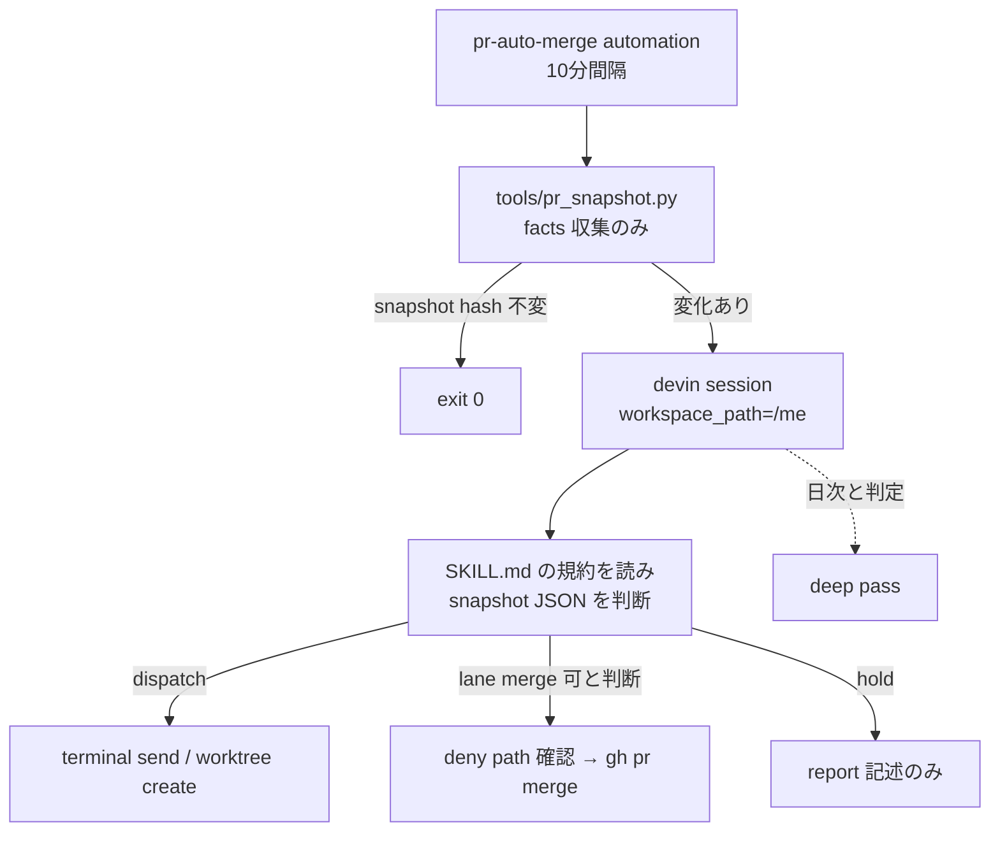

# Variant: LLM-conductor

Axis: **script は facts 収集だけ。判断は毎回 agent が SKILL.md の規約を読んで下す。**

## Flow



## 判定の所在

`pr_snapshot.py` は評価しない。出力するのは PR ごとの事実:

```json
{
  "repo": "wwwyo/me", "number": 123, "headSha": "...",
  "author": "wwwyo", "isBot": false,
  "mergeable": "MERGEABLE",
  "checks": [{"name": "pullfrog-approval", "status": "SUCCESS", "sha": "..."}],
  "unresolvedThreads": 0,
  "changesRequested": [{"reviewer": "pullfrog", "at": "..."}],
  "lastAuthorActivity": "...",
  "files": ["src/foo.ts", "docs/bar.md"],
  "linkedWorktree": {"path": "...", "agentState": "done", "liveTerminalCount": 1}
}
```

判定は agent が SKILL.md の規約（deny path・approval・unaddressed 定義・dispatch 上限・削除条件）を適用して下す。deny path や上限値は SKILL.md に書かれた規約テキストであり、agent の解釈に委ねられる。

## State

`state.json` は agent が読み書きする（script は `lastSnapshotHash` だけ更新）:

- dispatched/mergeAttempted/dispatchCount の管理は agent が state file を読んで行う
- 同じ `(headSha, lastReviewId)` への再送防止も規約として SKILL.md に書き、agent が守る

## 強み・弱み

- 強み: 実装が最も小さい（script は fetch のみ）。「内容で絞る」を diff の意味レベルで LLM が判定でき、deny path の網羅漏れを意味理解で補える。新しいレビュアー bot・新しい条件を SKILL.md に1行足すだけで効く
- 弱み: 関門が規約テキスト = LLM の解釈に依存する。dispatch 上限 3 回や「pullfrog-approval は現在 head に限る」も含め、守らせるのが instruction であり、破られても機械的に検知できない。変化があるたび LLM が起きるので、活発な日はコストが跳ねる。判定ミスは diff 可能なログ（state + report）には残るが、判定ロジック自体は検証不能
