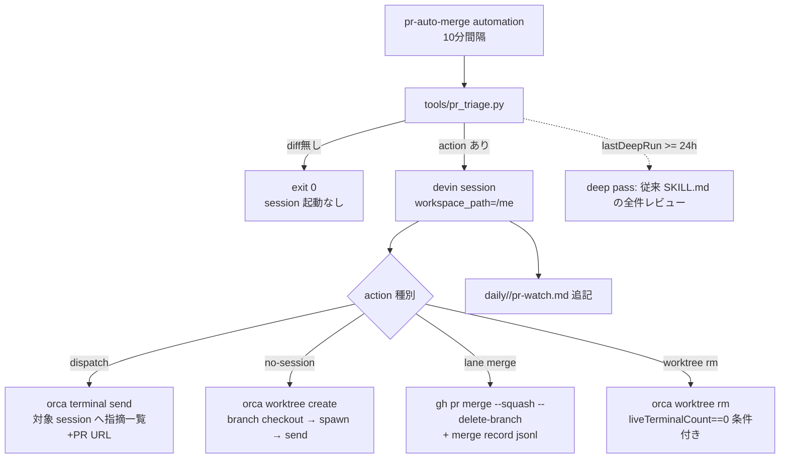

# Variant: Triage-first

Axis: **決定的 script が全判定を独占し、LLM は「必要な実行」の呼び出し先に過ぎない。**

## Flow



## 判定の所在

`pr_triage.py` が全ての判断を持つ:

- **unaddressed review**: GraphQL で `reviewThreads { isResolved }`・`reviews(state: CHANGES_REQUESTED, submittedAt)`・`commits`・`comments` を一括取得。未解消 thread か、最後の author 活動（push・返信）より新しい CHANGES_REQUESTED があれば未対応
- **session 突き合わせ**: `orca worktree ps --json` の `linkedPR.number` → `branch==headRef` の順で match。`agents[].state` が working なら送らない。見つからなければ spawn アクションを出す
- **lane merge**: author が dependabot 以外 かつ
  - `files` が deny path（`.github/`・auth/secrets・migration・infra・依存 manifest・`pullfrog.config.sh`・`AGENTS.md`/`CLAUDE.md`/`PROFILE.md`）に触れない
  - `pullfrog-approval` check が **現在 head SHA** で success
  - 未解消 thread 0・CI green・「絶対に merge しないもの」の機械的に判定できる全件
- **worktree rm**: `linkedPR.state==merged` かつ `liveTerminalCount==0` かつ `git status` clean かつ worktree HEAD == merged head SHA

## State

`~/.local/state/pr-watch/state.json`（runtime state、repo に載せない）:

```json
{
  "prs": {"wwwyo/me#123": {"head": "abc", "lastReviewId": "R1", "dispatched": 1, "mergeAttempted": false}},
  "dispatchCount": {"wwwyo/me#123": 2},
  "lastDeepRun": "2026-09-29T10:00:00+09:00",
  "lastSnapshotHash": "..."
}
```

- dedup key: `(repo, pr, headSha, lastReviewId)`。同じ指摘に二度送らない
- `dispatchCount >= 3` で送信打ち切り → report に `⚠️`（書き込み側で強制）
- `lastDeepRun >= 24h` で script が「deep pass 必要」を返し、agent が従来フローを走らせる

## LLM の役割

action が出たときだけ devin session を起こし、script が出した action リストを**実行**する。merge 判定・dispatch 判定を LLM がやり直さない。LLM が担うのは:

- `gh pr merge` / `orca terminal send` / `orca worktree rm` の発行
- PR へのレビュー済みコメント・report md/jsonl の記述
- deep pass（従来どおり）

## 強み・弱み

- 強み: 無変化 tick は python 一発で終わる（10分 × 144回/日 が LLM 0）。判定が全て diffable なコードにあり、監査・テスト可能。「関門は prompt ではなくコードで」を最も忠実に実装する
- 弱み: 「内容で絞る」を path deny で近似するため、deny に引っかからないが意味的に危険な diff（例: core logic の書き換え）も lane に入る — その判定は pullfrog-approval に委ねる設計。deny path の網羅性が永続的なメンテ点になる
