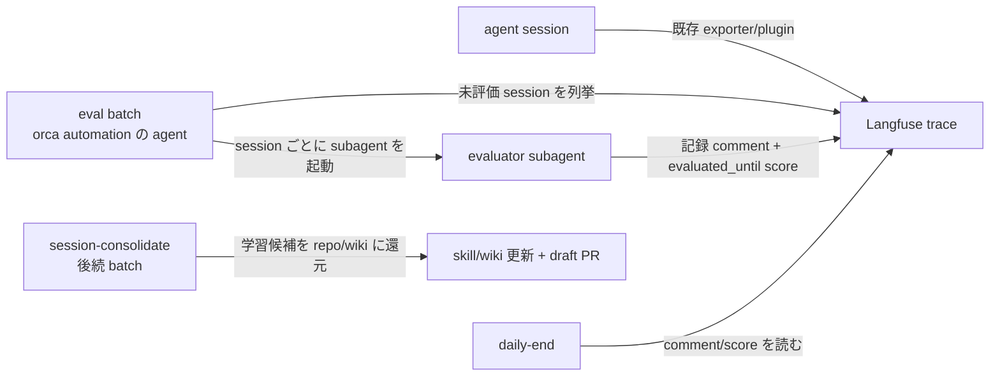

# Session 評価の Langfuse 移行

関連 ADR: [0001 Session 評価を Langfuse trace 駆動の定時 batch に移す](../../adr/0001-session-eval-on-langfuse-traces.md) / [0002 sessions.md を廃止し Langfuse を SSOT にする](../../adr/0002-sessions-md-replaced-by-langfuse-scores.md)

## Problem

SessionEnd hook が「transcript 組み立て → signal 判定 + 5見出し要約 + 学び還元（session-retro 自動実行）→ `wwwyo/me/daily/<date>/sessions.md` 追記」を担っている。この仕組みに3つの問題がある:

- **3重実装**: Claude・Codex・Devin で別々の script と transcript 正規化を持つ（Claude/Codex は JSONL、Devinは sessions.db の read-only 走査）
- **終了即時実行の複雑さ**: nohup detach・mkdir lock・再帰 guard・retry・`ACP_BACKEND` unset・`--permission-mode dangerous` といった防御コードが全部「終了イベントに乗せる」という選択から生じている
- **実績の不安定さ**: 2026-09-24 の sessions.md では同一 session の二重記録と、`gpt-6-luna` が ChatGPT アカウントで unsupported であることによる要約生成失敗が多発した

一方で session の trace は既に Langfuse に流れている（Devin は自作 exporter、Claude/Codex/pi は公式 plugin）。評価だけが hook 側に残っている。trace が揃った後なら評価は終了即時でなくてよく、定時 batch で足りる — 終了イベント由来の防御コードをまるごと消せる。

## 導出

repo の Story「複数 coding agent を日次運用する個人ハーネスを保つ」のうち、**session の振り返りと学び還元を低コストで持続する**部分から出る。

## Overview

既存の trace 送信はそのままに、**eval batch**（orca automation で起動する agent session）が未評価の Langfuse Session を列挙し、session ごとに evaluator subagent を起動する。evaluator subagent は **1回の run で transcript を読み、`## 事実`/`## 解釈（evaluator 所見）` の2部構成の記録を session comment として書き戻し、最後に `evaluated_until`（NUMERIC、観測済み最新 obs の `endTime or startTime` の epoch = 評価が覆った観測の上限）を書く**。分類値（track1/2 等）は持たない — 「この記録が学習価値を持つか」の解釈は消費側（session-consolidate・daily-end）が決める。学びの repo/wiki への還元は後続の session-consolidate batch が repo 単位でまとめて行う（ADR 0003）。session 単位を subagent に切るのは、transcript を親の context に溜め込まず・並列に回せるため。`sessions.md` は廃止し、daily-end は Langfuse を直接読む。

実行はローカルの定時（19:00 目安）batch。**「いつ走っても対象 session を全部拾う」べき等な形にする**ので、19:00 以降の session は翌日分に回り、daily-end 開始時に追加で蹴ってもよい。

対象 predicate とべき等の決定:

- 評価対象は「`evaluated_until` score が無い、またはその値（評価が覆った観測の上限 = 観測済み最新 obs の `endTime or startTime` の epoch）以降に完了した observation がある session」。後者により、評価時点で未完だった session に後続 turn が届いた場合は次回 run で自然に再評価される（「session 完了」の明示 signal は Devin の SessionEnd 発火しか保証がないため、完了判定には頼らず再評価で吸収する）。watermark は壁時計ではなく coverage で書く — fetch 後に ingest された turn も endTime が新しければ再対象になる
- 重複防止は local の実行 lock（flock 等）で batch を single-writer にする。cron と手動実行の並走だけを防ぐ範囲で十分とする
- 評価結果は session comment（記録、append-only）+ `evaluated_until` score で書き戻す。`evaluated_until` は完了 marker を兼ね、evaluator が必ず最後に書く — comment だけ書けて途中死亡した session は watermark が無いので次回 run でやり直される。再評価時は新しい comment が追記され、同名 score は最新を採用する

### 未確定事項

選択肢がある事項は先送りせず、prototype で試すかユーザーに確認して決める。実装中に潰せる技術検証はその限りでない。

**決定済み（2026-09-25 のユーザー確認）**:

- **session-retro の還元先 repo**: trace metadata の `transcript_path`（Devin では sessions.db の `working_directory` が入る）から解決する。解決できない session は `wwwyo/me` に還元する（fallback）
- **未完 session の扱い**: 届いている分で評価し、後続 trace が来たら次回 run で再評価（上記 predicate）
- **同時実行の重複防止**: 実行 lock
- **データ境界**: telemetry opt-in は評価結果（score + 要約 comment）の Langfuse 保存を含む同意とする
- **自己評価ループ防止**: batch 親 session・evaluator subagent の trace も Langfuse に載るため、列挙対象から除外する仕組みが要る（sentinel prompt の判定か、evaluator session の識別 metadata で filter）
- **subagent 深さ制限**: `CLAUDE_CODE_MAX_SUBAGENT_SPAWN_DEPTH=1` の環境では evaluator subagent から更に spawn できない。retro の実行は subagent が skill の手順を直接踏む形にする（session-retro skill を別 agent run として起動する形は取れない）

**実測で確定したもの（2026-09-25、JP cloud の org で実 API 検証済み）**:

- **列挙経路**: `GET /api/public/v2/observations`（`fromStartTime`/`toStartTime` で窓を絞り `fields=basic,metadata` で取得）を使い、sessionId で client 側集約する。`GET /api/public/sessions` はこの org では `LEGACY_API_UNAVAILABLE` で利用不可
- **session の束ね方**: 4 agent とも非 root observation に top-level `sessionId` が乗るため、**observation の sessionId で一律に束ねられる**。root span が sessionId を持たない実装がある（Codex・pi）ので、列挙は root 限定にせず全 observation を対象にするか `sessionId` 非 null で絞る。metadata にも `session_id` が冗長に入っている（Devin/pi）ので fallback には使える。（2026-09-26 再実測訂正: この org では codex/pi/devin の root observation 行にも top-level `sessionId` が乗ることを確認。root 限定 fetch + 行の `sessionId == sid` 照合でも正当行は落ちない）
- **可視性遅延は実質なし**: 送信から数分以内に v2 API で見える（SDK が `x-langfuse-ingestion-version: 4` を付けるため realtime 経路。Devin exporter の `langfuse==4.15.4`、plugin の `5.11.1` とも閾値を満たす）
- **repo 識別情報**: pi は `metadata.cwd` + `git_branch` が乗る。Codex plugin は metadata に cwd を持たない → Codex session は repo 識別が不能で、retro 時は `wwwyo/me` fallback になる（2026-09-27 変更: Devin exporter も `cwd` + emit 時点で確定した `repo_root`/`repo_name`/`git_branch` を送るよう揃えた。`--git-common-dir` 経由で linked worktree からでも canonical repo root が取れる。emit 済みの無い歴史 trace は reader 側が `orca/workspaces/<repo>/` 規約から repo 名を復元する。旧: Devin は `transcript_path` に working_directory が入るだけで、worktree 削除後は解決不能だった）
- **score の書き込み/読み出し**: 書き込みは legacy の `POST /api/public/scores` が使える（score-create は ingestion 経路で存続）。読み出しは `GET /api/public/v3/scores` で、**comment と session 紐付けは `fields=details,subject` を付けないと返らない**。BOOLEAN は payload では数値 0/1 で渡し、読み出しでは boolean で返る。同名 score は重複して付くため、再評価時は「最新の同名 score を採用」等のルールが要る。score config による事前スキーマ登録は不要
- **comment の書き込み/読み出し**: `POST /api/public/comments` に `{objectType: "SESSION", objectId, content}` で書け、読み出しは `GET /api/public/comments?objectType=SESSION&objectId=<sid>`。session 詳細ページの Comment パネルに表示される（score の comment 列より発見しやすい）。append-only で update/delete は無い
- **要約は score ではなく comment に書く**（2026-09-26 変更。旧: `session_summary` CATEGORICAL + `has_signal` BOOLEAN）。score value に track 分類を持たせると「この記録が学習価値を持つか」の解釈を evaluator が先回りして埋め込むことになる。観測の記録と evaluator 所見は comment 内の `## 事実` / `## 解釈` 見出しで分離し、採否は消費側が決める。`has_signal` の完了 marker 役は `evaluated_until` が兼任する（最後に書く順序で保証）
- **同一 turn の重複 trace**: Devin exporter は末尾 turn の signature 変化で再 emit するが、Langfuse 側では更新ではなく新 trace になるため、同一 `turn_number` の trace が複数本存在しうる（session 詳細で「同じ user message に別の回答」が並ぶ原因）。dedupe 実装は不要と判断（頻度が低く内容は正しい） — ただし judge が「ユーザーの繰り返し発言」と誤読して摩擦 signal を false positive しうるので、judge prompt に同一 turn の重複は途中経過の再 emit である旨を注記する
- **judge の読み取り範囲**: 全 observation の io を読む必要はない。turn 単位の span（例: `Devin - Turn N`）は input=user message・output=最終 assistant 応答（exporter 側で truncate 済み、1 turn あたり 0.1〜2KB 程度）なので、turn span の io のみを時系列で連結すれば session の概形 transcript が組める。tool の io は含めず、tool error の level/statusMessage だけ拾う形で摩擦判定には足りる想定。足りなければ対象 session のみ `fields=io` で深掘りする二段構えにする

### Goals

- 現行の session-retro 相当（signal 判定 → 要約 → 学び還元）を、per-agent の transcript 組み立てを排した Langfuse trace 駆動に置き換える
- 3重実装の SessionEnd 要約 hook を全廃する（Devin は trace 送信用の `langfuse-export.sh` のみ残す）
- 評価結果を Langfuse の session comment（事実/解釈分離の記録）+ `evaluated_until` score に集約し、API でクエリ可能にする
- batch はローカルで自動実行し、べき等・手動再実行可能にする

### Non-Goals

- 反復 FB の session 横断集計と rule 化（「同じ FB を繰り返さない」学習ループ）。評価基盤の上に載せる後続の論点
- turn 単位の摩擦評価、Langfuse managed evaluator の利用。session 単位評価には粒度が合わないため
- opt-in していない repo の session 評価。trace が無いので対象外（許容済み）
- Devin Cloud での batch/retro 実行。検討したがローカルで十分と判断
- `sessions.md` との後方互換。生成をやめ、daily-end 側を Langfuse 読みに改修する

## Glossary

- **Trace / Session / Score / Evaluator / evaluated_until**: repo root `AGENTS.md` の `## Glossary` を参照（SSOT）

## Acceptance Criteria

- [ ] 定時 batch が未評価 session を列挙し、Langfuse 上で session に記録 comment と `evaluated_until` score が見える
- [ ] 評価済み session の `学習候補` に対して session-consolidate の還元フローが自動で走る
- [x] Claude/Codex/Devin の SessionEnd 要約 hook が消え、`sessions.md` が新規生成されない（hooks dir は dir symlink のため merge 時点で即消失する。`sessions.md` の唯一の consumer は wwwyo/me の daily-end で Langfuse 読み切替は別 repo の作業 — ADR 0002 の順序上は切替が先だが、切替が未了ならこの PR の merge/apply と同じ window で行い、間の daily-end run が空入力を読むことを既知の gap として扱う）
- [ ] daily-end が sessions.md なしで、その日の session 一覧と記録を Langfuse から引ける（wwwyo/me 側の作業）
- [ ] batch を同日に2回走らせても、同じ session が二重に評価・記録されない

## Success Metrics

- コアアクション: daily-end で当日の session 評価を確認し、session-consolidate が出した学び PR をレビュー・処理する
- 期待頻度 (cycle): 日次
- 数える対象: daily-end を実行した日（未実行日・該当 session 0 件の日は分母から外す）のうち、Langfuse の評価結果を参照して振り返りが完結した日数
- 主指標: 移行後の2週間で上記の割合を記録する。旧 sessions.md 運用の参照率は計測していないため比較基準はなく、まず「評価参照込みで完結できるか」の成立確認を指標とする
